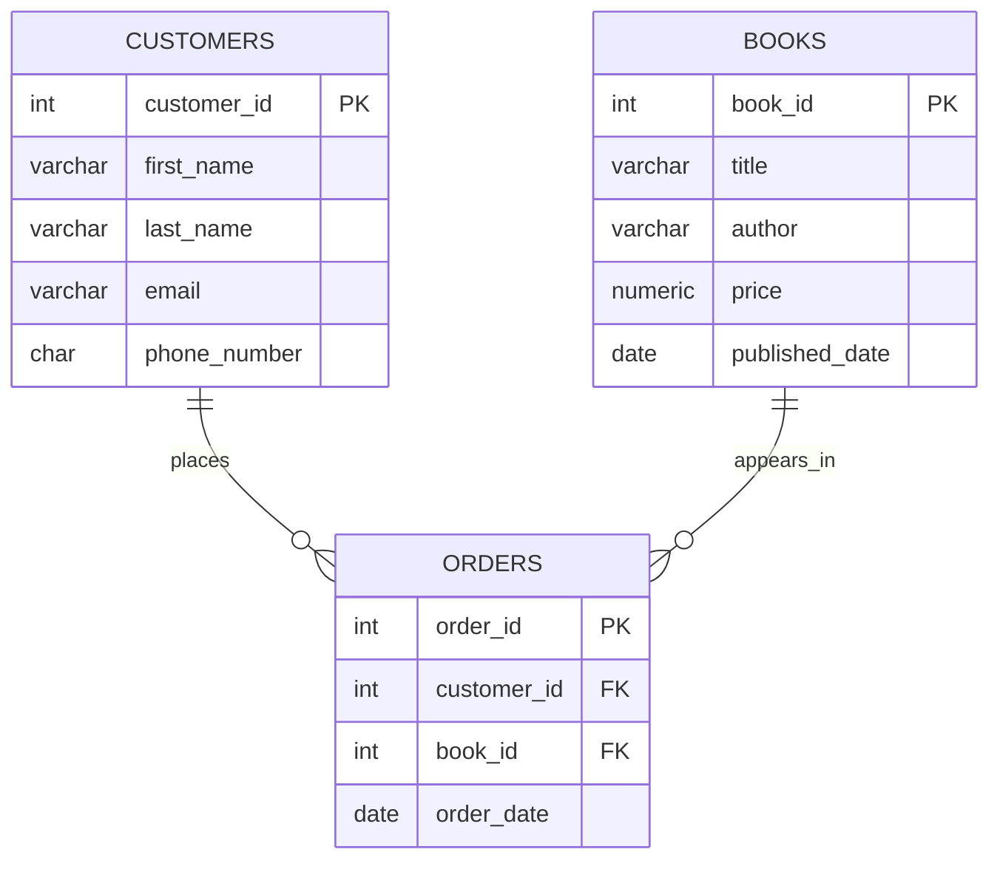

### **Introduction to Databases and SQL - Part 1**

> **Converted from:** `Introduction to Databases and SQL part 1(2).pdf`  
> **Purpose:** Beginner-friendly training notes for introducing databases, SQL, data types, constraints, and basic table creation in PostgreSQL.

---

### **Table of Contents**

1. [Introduction](#1-introduction)
2. [What Is Data?](#2-what-is-data)
3. [What Is a Database?](#3-what-is-a-database)
4. [Why Databases Are Needed](#4-why-databases-are-needed)
5. [Tables, Rows, and Columns](#5-tables-rows-and-columns)
6. [What Is a DBMS?](#6-what-is-a-dbms)
7. [Types of Databases](#7-types-of-databases)
8. [Secondary Classification of Databases](#8-secondary-classification-of-databases)
9. [What Is SQL?](#9-what-is-sql)
10. [SQL Command Categories](#10-sql-command-categories)
11. [SQL Data Types](#11-sql-data-types)
12. [SQL Constraints](#12-sql-constraints)
13. [Creating Schemas and Tables](#13-creating-schemas-and-tables)
14. [Practical Example: Customers, Books, and Orders](#14-practical-example-customers-books-and-orders)
15. [Relationships Between Tables](#15-relationships-between-tables)
16. [Viewing Data](#16-viewing-data)
17. [Best Practices](#17-best-practices)
18. [Practice Exercises](#18-practice-exercises)
19. [Summary](#19-summary)

---

### **1. Introduction**

Databases and SQL form one of the most important foundations in data, analytics, software development, and modern technology.

Almost every system used in daily life depends on a database. Examples include:

- Banks
- Hospitals
- Schools
- Supermarkets
- Mobile money platforms such as M-Pesa
- Social media platforms
- E-commerce applications
- Government systems
- Learning management systems

Whenever a user checks a balance, logs into an application, buys a product, makes a payment, books an appointment, or submits a form, data is being stored, retrieved, updated, or validated behind the scenes.

Before learning how to write SQL queries, it is important to understand:

- What data is
- How data is stored
- How databases are structured
- How tables relate to each other
- Why SQL is used
- How data types and constraints help maintain clean data

---

### **2. What Is Data?**

**Data** refers to raw pieces of information that can be stored, processed, and analyzed.

Examples of data include:

- Student names
- Phone numbers
- Salaries
- Product prices
- Dates
- Transactions
- Customer details
- Employee records
- Bank balances
- Course enrollment records

On its own, raw data may not be very useful. However, when data is organized and structured, it becomes meaningful and can be used to answer questions and support decision-making.

### **Example**

Raw data:

```text
James, HR, 50000
Amina, IT, 75000
```

Structured data:

| Name  | Department | Salary |
|---|---|---:|
| James | HR | 50,000 |
| Amina | IT | 75,000 |

Once data is organized into columns and rows, it becomes easier to filter, sort, search, calculate, and analyze.

---

### **3. What Is a Database?**

A **database** is an organized collection of related data stored electronically in a structured way.

A simple way to understand a database is:

> A database is like a smart Excel workbook, but more powerful, more secure, and better suited for storing large amounts of data.

### **Database vs Excel**

Excel is useful for small datasets and simple analysis. A database is better when the data is large, shared by many users, or connected across many tables.

| Feature | Excel | Database |
|---|---|---|
| Data storage | Worksheets | Tables |
| Data size | Good for small to medium data | Handles millions or billions of records |
| Multiple users | Limited collaboration | Designed for many users at once |
| Security | Basic protection | Strong user permissions and access control |
| Relationships | Manual or limited | Built-in relationships using keys |
| Data validation | Possible but limited | Strong rules using data types and constraints |
| Performance | Can become slow with large data | Optimized for fast retrieval and updates |

### **Examples of Databases**

A company database may store:

- Employee details
- Salaries
- Departments
- Leave records
- Payroll information

A hospital database may store:

- Patient records
- Doctor schedules
- Diagnoses
- Prescriptions
- Billing information

A school database may store:

- Student details
- Courses
- Enrollments
- Fees
- Attendance
- Grades

---

### **4. Why Databases Are Needed**

As organizations grow, the amount of data they collect increases significantly. Databases are used to manage this data efficiently and reliably.

### **Key Benefits of Databases**

Databases help organizations achieve:

- Efficient storage of large volumes of data
- Fast retrieval of specific information
- Easy updates and modifications
- Reduced duplication of data
- Improved accuracy and consistency
- Better security and access control
- Support for multiple users
- Easier reporting and analysis
- Better decision-making

Without databases, managing large amounts of information would be slow, error-prone, insecure, and difficult to scale.

### **Example Scenario**

Imagine a supermarket using spreadsheets to manage:

- Products
- Customers
- Sales
- Payments
- Suppliers
- Stock levels
- Discounts

As the business grows, the spreadsheet may become difficult to manage. Different staff may create duplicate records, formulas may break, and it may become hard to know which file contains the correct data.

A database solves this by storing data in structured tables and enforcing rules that keep the data accurate.

---

### **5. Tables, Rows, and Columns**

Most relational databases store data in **tables**, similar to Excel sheets.

A table organizes data into:

- **Columns** - define the type of information being stored
- **Rows** - represent individual records

### **Example Table: Employees**

| employee_id | name  | department | salary |
|---:|---|---|---:|
| 1 | James | HR | 50,000 |
| 2 | Amina | IT | 75,000 |

### **Key Components**

### **Column**

A **column** represents a type of data.

Examples:

- `employee_id`
- `name`
- `department`
- `salary`

### **Row**

A **row** represents one complete record.

Example:

| employee_id | name | department | salary |
|---:|---|---|---:|
| 1 | James | HR | 50,000 |

This row represents one employee.

### **Table**

A **table** stores records about one subject or entity.

Examples:

- `employees`
- `customers`
- `students`
- `products`
- `orders`

---

### **6. What Is a DBMS?**

A **DBMS** stands for **Database Management System**.

A DBMS is software used to create, manage, and interact with databases.

### **Examples of DBMS Software**

- PostgreSQL
- MySQL
- Oracle Database
- Microsoft SQL Server
- SQLite

### **What a DBMS Allows Users to Do**

A DBMS allows users to:

- Create databases
- Create tables
- Insert new data
- Update existing data
- Delete data
- Retrieve data
- Manage users and permissions
- Enforce data security
- Maintain consistency
- Support backup and recovery

### **Database vs DBMS**

| Term | Meaning |
|---|---|
| Database | The organized collection of stored data |
| DBMS | The software used to manage and interact with the database |

In simple terms:

> The database stores the data, while the DBMS provides the tools to manage the data.

---

### **7. Types of Databases**

Databases are broadly divided into two main categories:

1. Relational databases
2. Non-relational databases

---

### **7.1 Relational Databases**

A **relational database** stores data in structured tables made up of rows and columns. Tables can be related to each other using keys.

Relational databases are also called **RDBMS**, which stands for **Relational Database Management System**.

### **Examples**

- PostgreSQL
- MySQL
- Oracle Database
- Microsoft SQL Server

### **Key Characteristics**

Relational databases:

- Store data in tables
- Use a fixed structure called a schema
- Use rows and columns
- Use keys to connect tables
- Use SQL for querying
- Are suitable for structured data
- Are good when relationships between data are important

### **Example**

A school system may have separate tables for:

- Students
- Courses
- Teachers
- Enrollments

The `enrollments` table can connect students to courses.

---

### **7.2 Non-Relational Databases**

A **non-relational database** stores data in flexible formats instead of fixed tables.

Non-relational databases are also commonly called **NoSQL databases**.

### **Examples**

- MongoDB
- Redis
- Cassandra
- Neo4j

### **Key Characteristics**

Non-relational databases:

- Have flexible structures
- Do not always use fixed schemas
- Can store data as JSON, key-value pairs, graphs, or wide columns
- Are designed for scalability and performance
- Are suitable for large and rapidly changing data

### **Example**

A MongoDB record may look like this:

```json
{
  "student_id": 1,
  "name": "Amina",
  "skills": ["SQL", "Python", "Power BI"],
  "location": {
    "city": "Nairobi",
    "country": "Kenya"
  }
}
```

Another record in the same collection may have a different structure. This flexibility makes NoSQL databases useful for modern applications where data changes frequently.

---

### **7.3 Relational vs Non-Relational Databases**

| Feature | Relational Database | Non-Relational Database |
|---|---|---|
| Structure | Tables | Flexible formats |
| Schema | Fixed | Flexible |
| Relationships | Strong relationships using keys | Limited or handled differently |
| Query language | SQL | Varies by database |
| Best use | Structured data | Large, changing, flexible data |
| Example | PostgreSQL | MongoDB |

---

### **8. Secondary Classification of Databases**

Beyond relational and non-relational databases, databases can also be classified based on how they are deployed or optimized.

A useful way to understand databases is to ask two questions:

1. **How is the data structured?**
   - Relational
   - Non-relational

2. **How is the database deployed or optimized?**
   - Cloud
   - In-memory
   - Distributed
   - Embedded

Relational vs non-relational describes the **structure** of the data.

Cloud, in-memory, distributed, and embedded describe **how the database is used, hosted, or optimized**.

---

### **8.1 Cloud Databases**

A **cloud database** is hosted on the internet rather than on a local computer or company server.

### **Examples**

- Amazon RDS
- Azure Database for PostgreSQL
- Google Cloud SQL
- Aiven PostgreSQL

### **Characteristics**

Cloud databases are:

- Managed by cloud providers
- Scalable
- Accessible from anywhere with proper credentials
- Easier to back up and maintain
- Useful for modern applications and remote teams

A cloud database can be either relational or non-relational.

---

### **8.2 In-Memory Databases**

An **in-memory database** stores data in RAM instead of on disk.

### **Example**

- Redis

### **Characteristics**

In-memory databases are:

- Extremely fast
- Suitable for real-time applications
- Commonly used for caching
- Useful for session storage
- Helpful where speed is very important

### **Example Use Case**

A website can use Redis to store login sessions so users do not have to log in repeatedly.

---

### **8.3 Distributed Databases**

A **distributed database** stores data across multiple machines or servers.

### **Characteristics**

Distributed databases provide:

- High availability
- Improved performance
- Fault tolerance
- Better scalability

### **Example Use Case**

A global social media platform may store user data across servers in different regions to reduce delays and improve reliability.

---

### **8.4 Embedded Databases**

An **embedded database** runs inside an application instead of running as a separate database server.

### **Example**

- SQLite

### **Characteristics**

Embedded databases are:

- Lightweight
- Simple to use
- Easy to package with applications
- Common in mobile and desktop applications

### **Example Use Case**

A mobile app can use SQLite to store user preferences locally on the phone.

---

### **9. What Is SQL?**

**SQL** stands for **Structured Query Language**.

SQL is the standard language used to interact with relational databases.

SQL allows users to:

- Retrieve data
- Insert new data
- Update existing data
- Delete data
- Create database structures
- Modify database structures
- Control access to data
- Manage transactions

In simple terms:

> SQL allows users to ask structured questions from data and receive useful results.

### **Example**

```sql
SELECT first_name, last_name
FROM customers
WHERE customer_id = 1;
```

This query asks the database:

> Show me the first name and last name of the customer whose customer ID is 1.

---

### **10. SQL Command Categories**

SQL commands are grouped into categories based on their purpose.

The main SQL categories are:

1. DQL - Data Query Language
2. DML - Data Manipulation Language
3. DDL - Data Definition Language
4. DCL - Data Control Language
5. TCL - Transaction Control Language

---

### **10.1 DQL - Data Query Language**

**DQL** is used to retrieve data from a database.

The main DQL command is:

```sql
SELECT
```

Common clauses used with `SELECT` include:

- `WHERE`
- `ORDER BY`
- `GROUP BY`
- `HAVING`
- `JOIN`
- `DISTINCT`

### **Example**

```sql
SELECT department, COUNT(*) AS total_employees
FROM employees
GROUP BY department
ORDER BY total_employees DESC;
```

This query counts employees in each department and sorts the result from highest to lowest.

---

### **10.2 DML - Data Manipulation Language**

**DML** is used to modify data stored inside tables.

Common DML commands include:

- `INSERT`
- `UPDATE`
- `DELETE`

### **INSERT Example**

```sql
INSERT INTO employees (name, department, salary)
VALUES ('James', 'HR', 50000);
```

### **UPDATE Example**

```sql
UPDATE employees
SET salary = 55000
WHERE name = 'James';
```

### **DELETE Example**

```sql
DELETE FROM employees
WHERE name = 'James';
```

---

### **10.3 DDL - Data Definition Language**

**DDL** is used to define or change the structure of database objects.

Common DDL commands include:

- `CREATE`
- `ALTER`
- `DROP`
- `TRUNCATE`
- `RENAME`

### **CREATE Example**

```sql
CREATE TABLE employees (
    employee_id SERIAL PRIMARY KEY,
    name VARCHAR(100) NOT NULL,
    department VARCHAR(50),
    salary NUMERIC(10, 2)
);
```

### **ALTER Example**

```sql
ALTER TABLE employees
ADD COLUMN hire_date DATE;
```

### **DROP Example**

```sql
DROP TABLE employees;
```

> Be careful with `DROP` because it removes the table structure and data.

---

### **10.4 DCL - Data Control Language**

**DCL** is used to control access and permissions in the database.

Common DCL commands include:

- `GRANT`
- `REVOKE`

### **GRANT Example**

```sql
GRANT SELECT ON employees TO analyst_user;
```

This gives `analyst_user` permission to read data from the `employees` table.

### **REVOKE Example**

```sql
REVOKE SELECT ON employees FROM analyst_user;
```

This removes the permission.

---

### **10.5 TCL - Transaction Control Language**

**TCL** is used to manage transactions.

A transaction is a group of SQL operations that should be treated as one unit of work.

Common TCL commands include:

- `COMMIT`
- `ROLLBACK`
- `SAVEPOINT`

### **Example**

```sql
BEGIN;

UPDATE accounts
SET balance = balance - 1000
WHERE account_id = 1;

UPDATE accounts
SET balance = balance + 1000
WHERE account_id = 2;

COMMIT;
```

This example transfers money from one account to another. If one step fails, the transaction can be rolled back.

---

### **11. SQL Data Types**

### **11.1 Introduction to Data Types**

In SQL, **data types** define the kind of data that can be stored in each column of a table.

Each column should be designed to store a specific type of data.

Examples:

| Column | Suitable Data Type | Reason |
|---|---|---|
| `first_name` | `VARCHAR(50)` | Stores text |
| `salary` | `NUMERIC(10,2)` | Stores precise money values |
| `date_of_birth` | `DATE` | Stores dates |
| `is_active` | `BOOLEAN` | Stores true or false |
| `phone_number` | `VARCHAR(20)` or `CHAR(13)` | Stores digits and symbols as text |

### **Why Data Types Are Important**

Data types help to:

- Ensure correct data entry
- Prevent invalid values
- Improve storage efficiency
- Improve query performance
- Support accurate calculations
- Maintain consistency across the database

### **Examples**

- Storing salary as a numeric type allows mathematical calculations.
- Storing dates as date types enables sorting, filtering, and date functions.
- Storing status as boolean ensures only true or false values are allowed.

---

### **11.2 Main Categories of PostgreSQL Data Types**

PostgreSQL data types can be grouped into the following categories:

1. Numeric data types
2. Character or string data types
3. Date and time data types
4. Boolean data type
5. Special data types

---

### **11.3 Numeric Data Types**

Numeric data types are used to store numbers.

### **Whole Number Types**

| Data Type | Description | Example Use Case |
|---|---|---|
| `SMALLINT` | Stores small whole numbers | Age, rating scale |
| `INTEGER` / `INT` | Stores standard whole numbers | Quantity, count |
| `BIGINT` | Stores very large whole numbers | Large IDs, population counts |
| `SERIAL` | Auto-incrementing integer | Primary key IDs |
| `BIGSERIAL` | Auto-incrementing large integer | Very large primary key IDs |

### **Example**

```sql
CREATE TABLE students (
    student_id SERIAL PRIMARY KEY,
    age INT
);
```

In this example, `student_id` automatically increases whenever a new student is inserted.

---

### **11.4 Exact Decimal Types**

Exact decimal types are used when precision is very important.

Common exact decimal types:

- `NUMERIC(p, s)`
- `DECIMAL(p, s)`

Where:

- `p` means precision, which is the total number of digits
- `s` means scale, which is the number of digits after the decimal point

### **Example**

```sql
price NUMERIC(10, 2)
```

This means:

- Total digits allowed: 10
- Digits after decimal point: 2
- Digits before decimal point: 8

So values such as the following can be stored:

```text
1500.00
99999999.99
25000.50
```

### **Best Use Cases**

Use `NUMERIC` or `DECIMAL` for:

- Salaries
- Product prices
- Taxes
- Account balances
- Financial transactions

> For financial data, avoid approximate decimal types because they may introduce rounding errors.

---

### **11.5 Approximate Decimal Types**

Approximate decimal types store decimal values but may have small rounding differences.

Common approximate decimal types:

- `REAL`
- `DOUBLE PRECISION`

### **Best Use Cases**

Use approximate decimal types for:

- Scientific data
- Measurements
- Analytical computations
- Sensor values

### **Not Recommended For**

Avoid using approximate decimals for:

- Money
- Salaries
- Bank balances
- Taxes
- Invoices

---

### **11.6 Character/String Data Types**

Character data types are used to store text such as names, emails, phone numbers, and descriptions.

| Data Type | Description | Example |
|---|---|---|
| `CHAR(n)` | Fixed-length text | Country codes, fixed phone formats |
| `VARCHAR(n)` | Variable-length text with a maximum limit | Names, emails |
| `TEXT` | Variable-length text with no strict short limit | Long descriptions, comments |

### **CHAR(n)**

`CHAR(n)` always stores exactly `n` characters.

Example:

```sql
country_code CHAR(2)
```

This can store values like:

```text
KE
UG
TZ
```

### **VARCHAR(n)**

`VARCHAR(n)` stores text up to a maximum length.

Example:

```sql
email VARCHAR(100)
```

This means the email can contain up to 100 characters.

### **TEXT**

`TEXT` is used for long text.

Example:

```sql
description TEXT
```

This can store long descriptions, comments, or notes.

### **Why Phone Numbers Should Be Stored as Text**

Phone numbers should usually be stored as `VARCHAR` or `CHAR`, not numeric values.

Reasons:

- They may include symbols such as `+`
- They may start with zero
- They are not used for calculations
- They may include spaces or formatting characters

Example:

```sql
phone_number VARCHAR(20)
```

---

### **11.7 Date and Time Data Types**

Date and time data types are used to store date and time values.

| Data Type | Description | Example Use Case |
|---|---|---|
| `DATE` | Stores date only | Date of birth, hire date |
| `TIME` | Stores time only | Class start time |
| `TIMESTAMP` | Stores date and time | Transaction time |
| `TIMESTAMPTZ` | Stores date and time with timezone | Global systems |

### **Examples**

```sql
CREATE TABLE events (
    event_id SERIAL PRIMARY KEY,
    event_name VARCHAR(100),
    event_date DATE,
    start_time TIME,
    created_at TIMESTAMP,
    global_created_at TIMESTAMPTZ
);
```

### **When to Use Each Type**

| Scenario | Recommended Type |
|---|---|
| Student date of birth | `DATE` |
| Employee hire date | `DATE` |
| Transaction date and time | `TIMESTAMP` |
| International application timestamps | `TIMESTAMPTZ` |
| Daily class start time | `TIME` |

---

### **11.8 Boolean Data Type**

The `BOOLEAN` data type stores true or false values.

Common examples:

- `is_active`
- `is_admin`
- `in_stock`
- `is_enrolled`
- `has_paid`

### **Example**

```sql
CREATE TABLE users (
    user_id SERIAL PRIMARY KEY,
    full_name VARCHAR(100),
    is_active BOOLEAN DEFAULT TRUE
);
```

In this example, each new user is active by default unless stated otherwise.

---

### **11.9 Special PostgreSQL Data Types**

PostgreSQL provides additional data types for advanced use cases.

### **UUID**

`UUID` is used to store unique identifiers across systems.

Example:

```sql
user_uuid UUID
```

UUIDs are useful when records need globally unique IDs, especially in distributed systems.

### **JSON / JSONB**

`JSON` and `JSONB` store structured data in JSON format.

Used for:

- Flexible data
- API responses
- Metadata
- Configurations

Example:

```sql
metadata JSONB
```

### **ARRAY**

`ARRAY` stores multiple values in one column.

Used for:

- Tags
- Skills
- Multiple categories

Example:

```sql
skills TEXT[]
```

> Although arrays can be useful, beginners should first learn relational design because storing multiple values in one column can sometimes make analysis harder.

---

### **11.10 Choosing the Right Data Type**

Choosing the correct data type is important for good database design.

### **Guidelines**

| Data Need | Recommended Data Type |
|---|---|
| Whole numbers | `INT` or `BIGINT` |
| Auto-generated IDs | `SERIAL` or `BIGSERIAL` |
| Money and precise decimals | `NUMERIC` or `DECIMAL` |
| Names and emails | `VARCHAR` |
| Long descriptions | `TEXT` |
| Dates | `DATE` |
| Date and time | `TIMESTAMP` or `TIMESTAMPTZ` |
| True/false values | `BOOLEAN` |
| Phone numbers | `VARCHAR` or `CHAR` |

### **Common Mistakes**

Avoid these mistakes:

- Storing phone numbers as numbers
- Storing money using `REAL` or `DOUBLE PRECISION`
- Using `TEXT` for every column
- Misunderstanding precision and scale
- Confusing `NULL` with zero or an empty string
- Storing dates as text

---

### **12. SQL Constraints**

### **12.1 What Are Constraints?**

**Constraints** are rules applied to columns or tables to control what data can be stored.

They help ensure:

- Accuracy
- Consistency
- Data integrity
- Data validity
- Reliable relationships between tables

A simple way to remember this is:

> Data types define what kind of data can be stored. Constraints define the rules that the data must follow.

---

### **12.2 NOT NULL Constraint**

`NOT NULL` ensures that a column must have a value.

### **Example**

```sql
first_name VARCHAR(50) NOT NULL
```

This means every record must have a first name.

If someone tries to insert a record without a first name, the database will reject it.

---

### **12.3 NULL**

`NULL` means a column is allowed to have no value.

Important:

> `NULL` does not mean zero, blank, or empty string. It means unknown, missing, or not provided.

### **Example**

```sql
middle_name VARCHAR(50)
```

Since `NOT NULL` is not specified, the column can contain `NULL`.

---

### **12.4 DEFAULT Constraint**

`DEFAULT` provides a value automatically when no value is supplied.

### **Example**

```sql
is_active BOOLEAN DEFAULT TRUE
```

If no value is entered for `is_active`, the database automatically stores `TRUE`.

Another example:

```sql
created_at TIMESTAMP DEFAULT CURRENT_TIMESTAMP
```

This automatically stores the current date and time.

---

### **12.5 PRIMARY KEY Constraint**

A `PRIMARY KEY` uniquely identifies each row in a table.

### **Characteristics of a Primary Key**

A primary key:

- Must be unique
- Cannot be null
- Identifies each row
- Should not change frequently
- Usually appears once per table

### **Example**

```sql
customer_id SERIAL PRIMARY KEY
```

This creates an auto-incrementing ID that uniquely identifies each customer.

---

### **12.6 UNIQUE Constraint**

`UNIQUE` ensures that all values in a column are different.

### **Example**

```sql
email VARCHAR(100) UNIQUE NOT NULL
```

This ensures that two customers cannot have the same email address.

---

### **12.7 FOREIGN KEY Constraint**

A `FOREIGN KEY` creates a relationship between two tables.

It ensures that a value in one table exists in another table.

### **Example**

```sql
customer_id INT REFERENCES customers(customer_id)
```

This means the `customer_id` stored in the current table must already exist in the `customers` table.

Foreign keys are important because they:

- Connect related tables
- Prevent invalid references
- Maintain data integrity
- Reduce duplication

---

### **12.8 CHECK Constraint**

A `CHECK` constraint ensures that values meet a specific condition.

### **Example: Salary Must Be Greater Than Zero**

```sql
salary NUMERIC(10, 2) CHECK (salary > 0)
```

### **Example: Age Must Be Between 1 and 99**

```sql
age INT CHECK (age > 0 AND age < 100)
```

`CHECK` constraints are useful for preventing invalid values.

---

### **12.9 INDEX**

An `INDEX` improves data retrieval speed.

Strictly speaking, an index is not usually treated as a constraint, but it is often discussed together with constraints because it supports performance and sometimes uniqueness.

### **Example**

```sql
CREATE INDEX idx_customers_email
ON customers(email);
```

This can make searching by email faster.

---

### **12.10 Composite Primary Key**

A **composite primary key** is a primary key made up of multiple columns.

It is used when one column alone is not enough to uniquely identify a row.

### **Example**

```sql
CREATE TABLE course_enrollments (
    student_id INT,
    course_id INT,
    enrollment_date DATE,
    PRIMARY KEY (student_id, course_id)
);
```

In this example, the combination of `student_id` and `course_id` must be unique.

---

### **12.11 Exclusion Constraint**

An **exclusion constraint** prevents conflicting or overlapping data.

It is commonly used in advanced scenarios such as scheduling systems.

### **Example Use Case**

A meeting room booking system should prevent two meetings from being booked in the same room at the same time.

---

### **12.12 Column-Level vs Table-Level Constraints**

Constraints can be applied at two levels:

1. Column level
2. Table level

### **Column-Level Constraint**

A column-level constraint applies to one column.

Example:

```sql
email VARCHAR(100) UNIQUE NOT NULL
```

### **Table-Level Constraint**

A table-level constraint can involve one or more columns.

Example:

```sql
PRIMARY KEY (student_id, course_id)
```

---

### **13. Creating Schemas and Tables**

### **13.1 What Is a Table?**

A table is the primary structure used to store data in a relational database.

A table organizes data into:

- Columns, which define structure and data types
- Rows, which store individual records

Each table usually represents a specific entity.

Examples:

- A `customers` table stores customer information
- A `books` table stores book details
- An `orders` table stores transaction records

---

### **13.2 What Is a Schema?**

A **schema** is a logical container used to group related database objects such as tables, views, and functions.

A schema helps organize a database, especially when there are many tables.

### **Example**

```sql
CREATE SCHEMA luxsql;
SET search_path TO luxsql;
```

Explanation:

- `CREATE SCHEMA luxsql;` creates a schema called `luxsql`.
- `SET search_path TO luxsql;` tells PostgreSQL to use `luxsql` as the default working schema.

---

### **14. Practical Example: Customers, Books, and Orders**

This practical example creates a simple database structure for a bookshop.

The database contains three tables:

1. `customers`
2. `books`
3. `orders`

The goal is to demonstrate:

- Table creation
- Data types
- Primary keys
- Foreign keys
- Inserting records
- Relationships between tables

---

### **14.1 Create Schema**

```sql
CREATE SCHEMA luxsql;
SET search_path TO luxsql;
```

---

### **14.2 Customers Table**

The `customers` table stores information about customers.

### **SQL Script**

```sql
CREATE TABLE customers (
    customer_id SERIAL PRIMARY KEY,
    first_name VARCHAR(50) NOT NULL,
    last_name VARCHAR(50) NOT NULL,
    email VARCHAR(100) UNIQUE NOT NULL,
    phone_number CHAR(13)
);
```

### **Explanation of Columns**

| Column | Data Type / Constraint | Explanation |
|---|---|---|
| `customer_id` | `SERIAL PRIMARY KEY` | Auto-incrementing unique identifier for each customer |
| `first_name` | `VARCHAR(50) NOT NULL` | Stores the first name and requires a value |
| `last_name` | `VARCHAR(50) NOT NULL` | Stores the last name and requires a value |
| `email` | `VARCHAR(100) UNIQUE NOT NULL` | Stores email address, requires a value, and prevents duplicates |
| `phone_number` | `CHAR(13)` | Stores phone number with country code |

### **Why Phone Number Is Stored as Text**

Phone numbers are stored as text because they:

- May include symbols such as `+`
- May start with zero
- Are not used for calculations
- May have fixed formatting requirements

---

### **14.3 Insert Data into Customers**

```sql
INSERT INTO customers (first_name, last_name, email, phone_number) VALUES
('John', 'Doe', 'john.doe@example.com', '+254712345678'),
('Jane', 'Smith', 'jane.smith@example.com', '+254798765432'),
('Paul', 'Otieno', 'paul.otieno@example.com', '+254701234567'),
('Mary', 'Okello', 'mary.okello@example.com', '+254711223344');
```

### **Important Note**

The `customer_id` column is not included in the insert statement because it is automatically generated by `SERIAL`.

---

### **14.4 Books Table**

The `books` table stores information about books.

### **SQL Script**

```sql
CREATE TABLE books (
    book_id SERIAL PRIMARY KEY,
    title VARCHAR(150) NOT NULL,
    author VARCHAR(100),
    price NUMERIC(8, 2) NOT NULL,
    published_date DATE
);
```

### **Explanation of Columns**

| Column | Data Type / Constraint | Explanation |
|---|---|---|
| `book_id` | `SERIAL PRIMARY KEY` | Auto-incrementing unique identifier for each book |
| `title` | `VARCHAR(150) NOT NULL` | Stores book title and requires a value |
| `author` | `VARCHAR(100)` | Stores author name |
| `price` | `NUMERIC(8,2) NOT NULL` | Stores precise monetary values |
| `published_date` | `DATE` | Stores the publication date |

### **Understanding `NUMERIC(8,2)`**

`NUMERIC(8,2)` means:

- Total digits: 8
- Digits after decimal point: 2
- Digits before decimal point: 6

Example values:

```text
1500.00
2500.00
999999.99
```

This is suitable for money because it avoids rounding errors.

---

### **14.5 Insert Data into Books**

```sql
INSERT INTO books (title, author, price, published_date) VALUES
('Understanding SQL', 'David Kimani', 1500.00, '2023-01-15'),
('Advanced PostgreSQL', 'Grace Achieng', 2500.00, '2023-02-20'),
('Learning Python', 'James Mwangi', 3000.00, '2022-11-10'),
('Data Analytics Basics', 'Susan Njeri', 2200.00, '2023-03-05');
```

---

### **14.6 Orders Table**

The `orders` table records transactions and links customers to books.

### **SQL Script**

```sql
CREATE TABLE orders (
    order_id SERIAL PRIMARY KEY,
    customer_id INT REFERENCES customers(customer_id),
    book_id INT REFERENCES books(book_id),
    order_date DATE DEFAULT CURRENT_DATE
);
```

### **Explanation of Columns**

| Column | Data Type / Constraint | Explanation |
|---|---|---|
| `order_id` | `SERIAL PRIMARY KEY` | Unique identifier for each order |
| `customer_id` | `INT REFERENCES customers(customer_id)` | Links each order to a customer |
| `book_id` | `INT REFERENCES books(book_id)` | Links each order to a book |
| `order_date` | `DATE DEFAULT CURRENT_DATE` | Stores order date and defaults to the current date |

---

### **14.7 Insert Data into Orders**

The `orders` table stores transactions by linking customers to books using IDs.

Because `customer_id` and `book_id` are auto-generated, the inserted values correspond to the order in which records were inserted.

### **Customer IDs**

| customer_id | Customer |
|---:|---|
| 1 | John Doe |
| 2 | Jane Smith |
| 3 | Paul Otieno |
| 4 | Mary Okello |

### **Book IDs**

| book_id | Book |
|---:|---|
| 1 | Understanding SQL |
| 2 | Advanced PostgreSQL |
| 3 | Learning Python |
| 4 | Data Analytics Basics |

### **SQL Script**

```sql
INSERT INTO orders (customer_id, book_id, order_date)
VALUES
(1, 3, '2023-04-01'),
(2, 1, '2023-04-02'),
(3, 2, '2023-04-03'),
(4, 4, '2023-04-04'),
(1, 2, '2023-04-05');
```

### **Explanation of Records**

| Order | Meaning |
|---|---|
| `(1, 3, '2023-04-01')` | John ordered Learning Python |
| `(2, 1, '2023-04-02')` | Jane ordered Understanding SQL |
| `(3, 2, '2023-04-03')` | Paul ordered Advanced PostgreSQL |
| `(4, 4, '2023-04-04')` | Mary ordered Data Analytics Basics |
| `(1, 2, '2023-04-05')` | John ordered Advanced PostgreSQL |

---

### **15. Relationships Between Tables**

This schema demonstrates relational database design.

### **Relationship Rules**

- One customer can make many orders.
- One book can appear in many orders.
- The `orders` table connects customers and books.

Instead of storing full customer and book details inside the `orders` table, only IDs are stored.

This helps to:

- Avoid duplication
- Maintain consistency
- Reduce storage waste
- Make updates easier
- Connect related data efficiently

### **Entity Relationship Diagram**



### **Explanation**

The relationship between `customers` and `orders` is one-to-many:

- One customer can have many orders.
- Each order belongs to one customer.

The relationship between `books` and `orders` is one-to-many:

- One book can appear in many orders.
- Each order references one book.

---

### **16. Viewing Data**

After creating tables and inserting data, use `SELECT` statements to view the records.

```sql
SELECT * FROM customers;
SELECT * FROM books;
SELECT * FROM orders;
```

### **Explanation**

`SELECT *` means:

> Select all columns from the table.

For example:

```sql
SELECT * FROM customers;
```

This displays all records and columns in the `customers` table.

---

### **16.1 Viewing Joined Data**

The `orders` table stores IDs, but sometimes we want to see the actual customer names and book titles.

Use a `JOIN` to combine data from related tables.

```sql
SELECT
    o.order_id,
    c.first_name,
    c.last_name,
    b.title,
    b.price,
    o.order_date
FROM orders o
JOIN customers c
    ON o.customer_id = c.customer_id
JOIN books b
    ON o.book_id = b.book_id;
```

### **Result Meaning**

This query shows:

- Order ID
- Customer first name
- Customer last name
- Book title
- Book price
- Order date

This is more readable than viewing only numeric IDs.

---

### **16.2 Basic Analysis Queries**

### **Count Total Customers**

```sql
SELECT COUNT(*) AS total_customers
FROM customers;
```

### **Count Total Books**

```sql
SELECT COUNT(*) AS total_books
FROM books;
```

### **Count Total Orders**

```sql
SELECT COUNT(*) AS total_orders
FROM orders;
```

### **Find Total Revenue**

```sql
SELECT SUM(b.price) AS total_revenue
FROM orders o
JOIN books b
    ON o.book_id = b.book_id;
```

### **Find Orders Per Customer**

```sql
SELECT
    c.first_name,
    c.last_name,
    COUNT(o.order_id) AS total_orders
FROM customers c
LEFT JOIN orders o
    ON c.customer_id = o.customer_id
GROUP BY c.customer_id, c.first_name, c.last_name
ORDER BY total_orders DESC;
```

---

### **17. Best Practices**

Good database design requires careful planning.

### **Recommended Practices**

- Use meaningful table names.
- Use meaningful column names.
- Choose appropriate data types.
- Use primary keys to uniquely identify records.
- Use foreign keys to create relationships.
- Avoid duplicate data.
- Store phone numbers as text.
- Use numeric types for monetary values.
- Use date types for dates instead of text.
- Use constraints to protect data quality.
- Keep table names consistent.
- Use lowercase names with underscores in PostgreSQL.

### **Naming Examples**

Good names:

```text
customers
books
orders
customer_id
order_date
phone_number
```

Avoid unclear names:

```text
table1
col1
custName
bkprice
```

---

### **18. Practice Exercises**

Use the practical database created above to answer the following questions.

### **Exercise 1: View All Customers**

Write a query to display all customers.

```sql
SELECT * FROM customers;
```

---

### **Exercise 2: View Customer Names Only**

Write a query to display only first names and last names.

```sql
SELECT first_name, last_name
FROM customers;
```

---

### **Exercise 3: Find Books Above 2,000**

Write a query to display books whose price is greater than 2,000.

```sql
SELECT *
FROM books
WHERE price > 2000;
```

---

### **Exercise 4: Sort Books by Price**

Write a query to sort books from most expensive to least expensive.

```sql
SELECT *
FROM books
ORDER BY price DESC;
```

---

### **Exercise 5: Count Orders Per Customer**

Write a query to count how many orders each customer has made.

```sql
SELECT
    c.first_name,
    c.last_name,
    COUNT(o.order_id) AS total_orders
FROM customers c
LEFT JOIN orders o
    ON c.customer_id = o.customer_id
GROUP BY c.customer_id, c.first_name, c.last_name;
```

---

### **Exercise 6: Show Customer and Book Ordered**

Write a query to show each customer's name and the book they ordered.

```sql
SELECT
    c.first_name,
    c.last_name,
    b.title,
    o.order_date
FROM orders o
JOIN customers c
    ON o.customer_id = c.customer_id
JOIN books b
    ON o.book_id = b.book_id;
```

---

### **Exercise 7: Add a CHECK Constraint**

Create a table where age must be greater than zero and less than 100.

```sql
CREATE TABLE learners (
    learner_id SERIAL PRIMARY KEY,
    full_name VARCHAR(100) NOT NULL,
    age INT CHECK (age > 0 AND age < 100)
);
```

---

### **Exercise 8: Add a Default Timestamp**

Create a table where the created date is automatically stored.

```sql
CREATE TABLE registrations (
    registration_id SERIAL PRIMARY KEY,
    learner_name VARCHAR(100) NOT NULL,
    created_at TIMESTAMP DEFAULT CURRENT_TIMESTAMP
);
```

---

### **19. Summary**

### **Key Concepts Covered**

- Data is raw information that can be stored and analyzed.
- A database stores organized data.
- A DBMS is software used to manage databases.
- Relational databases store data in tables.
- Non-relational databases store data in flexible formats.
- SQL is used to interact with relational databases.
- SQL commands are grouped into DQL, DML, DDL, DCL, and TCL.
- Data types define the kind of data stored in each column.
- Constraints define rules that data must follow.
- Primary keys uniquely identify records.
- Foreign keys create relationships between tables.
- Tables should be designed to avoid duplication and maintain consistency.

### **Final Reminder**

A good database is not just about storing data. It is about storing data in a way that is:

- Clean
- Organized
- Consistent
- Secure
- Easy to query
- Easy to maintain
- Useful for decision-making

---

### **Complete SQL Script**

Use the full script below to create and populate the example database.

```sql
CREATE SCHEMA luxsql;
SET search_path TO luxsql;

CREATE TABLE customers (
    customer_id SERIAL PRIMARY KEY,
    first_name VARCHAR(50) NOT NULL,
    last_name VARCHAR(50) NOT NULL,
    email VARCHAR(100) UNIQUE NOT NULL,
    phone_number CHAR(13)
);

INSERT INTO customers (first_name, last_name, email, phone_number) VALUES
('John', 'Doe', 'john.doe@example.com', '+254712345678'),
('Jane', 'Smith', 'jane.smith@example.com', '+254798765432'),
('Paul', 'Otieno', 'paul.otieno@example.com', '+254701234567'),
('Mary', 'Okello', 'mary.okello@example.com', '+254711223344');

CREATE TABLE books (
    book_id SERIAL PRIMARY KEY,
    title VARCHAR(150) NOT NULL,
    author VARCHAR(100),
    price NUMERIC(8, 2) NOT NULL,
    published_date DATE
);

INSERT INTO books (title, author, price, published_date) VALUES
('Understanding SQL', 'David Kimani', 1500.00, '2023-01-15'),
('Advanced PostgreSQL', 'Grace Achieng', 2500.00, '2023-02-20'),
('Learning Python', 'James Mwangi', 3000.00, '2022-11-10'),
('Data Analytics Basics', 'Susan Njeri', 2200.00, '2023-03-05');

CREATE TABLE orders (
    order_id SERIAL PRIMARY KEY,
    customer_id INT REFERENCES customers(customer_id),
    book_id INT REFERENCES books(book_id),
    order_date DATE DEFAULT CURRENT_DATE
);

INSERT INTO orders (customer_id, book_id, order_date)
VALUES
(1, 3, '2023-04-01'),
(2, 1, '2023-04-02'),
(3, 2, '2023-04-03'),
(4, 4, '2023-04-04'),
(1, 2, '2023-04-05');

SELECT * FROM customers;
SELECT * FROM books;
SELECT * FROM orders;
```
